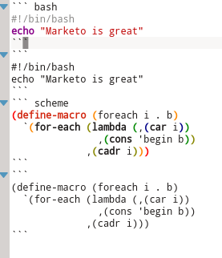

# Marketo

A KDE application for note taking with the power of lightweight markup language.

It is bundled with a separated Markdown editor.

## Features
+ Use **katepart** as the default editor (cool **vim mode**)
+ Partially support **CommonMark**
+ Live Preview(auto sync between two views)
+ Real-time fenced-code highlight
+ MathJax support

  


## Planning
+ Integrated with baloo for search
+ Git support
+ Support blog post generating

## For User

See [Installation Guide](https://github.com/sadhen/marketo/wiki/Install-Guide) to install Marketo.

Starting Marknoto, you will see the guide - [The Home Note](marknoto/Home.md).

## For Developer

### Dependencies

You need to install [libmdcpp](https://github.com/sadhen/libmdcpp) first.

Also you need to install many other dependencies for compiling. Please see the CMakeLists.txt file for more info.

### Compile

Then follow these instructions:
``` sh
cd /tmp
git clone https://github.com/sadhen/marketo.git
cd marketo
mkdir $HOME/software
mkdir build
cd build
cmake -DCMAKE_INSTALL_PREFIX=$HOME/.local ..
make
make install
```

**NOTE**: `$HOME` is your home directory. The above instructions will install Marketo in `$HOME/.local`.

### Run it
``` sh
cd ~/.local/bin/
./marknoto # this will launch the note-taking application
./markpado # this will launch the Markdown editor
```

## License


Copyright © 2014,2015 Darcy Shen
